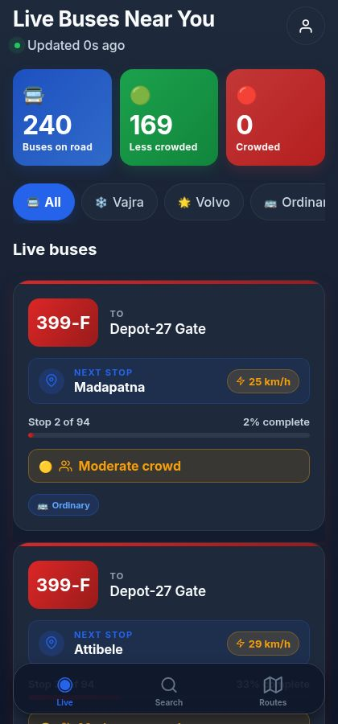
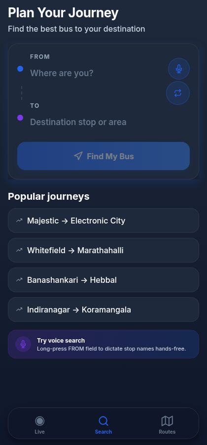
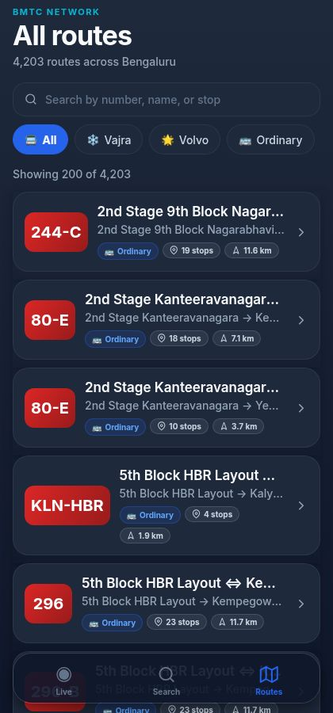
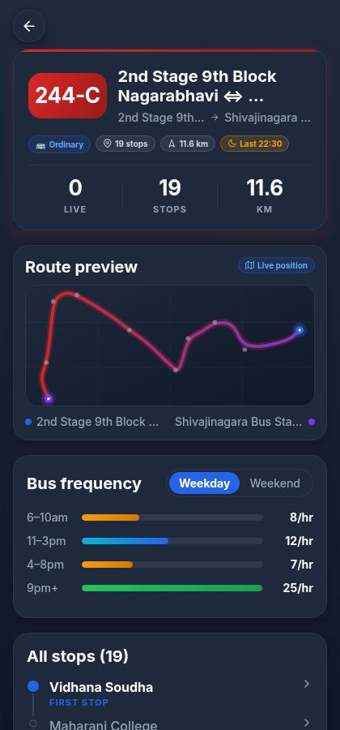

# SmartBus AI: A Mobile-First Real-Time Bus Tracking and Crowd-Aware Journey Planning System for the BMTC Network

<!-- AUTHOR_BLOCK -->

---

## ABSTRACT

Bengaluru's BMTC network moves close to four million riders a day across 4,203 routes and 6,006 stops, yet the everyday rider still walks up to a stop without knowing whether a bus is on its way, how full it will be, or whether a better route exists. We address this gap with *SmartBus AI*, a cross-platform mobile application that combines live vehicle tracking, crowd-aware journey planning, route discovery, and per-route frequency analytics behind a single accessibility-first interface. The system is built on the official BMTC GTFS feed, a deterministic in-process simulator that produces 240 live vehicles on a 12-second tick (since BMTC has not yet released a public GTFS-Realtime feed), and a heuristic crowd-prediction model that classifies each bus into one of three semantic occupancy bands using time-of-day, route-popularity, vehicle-type, and day-of-week features. The client is implemented in Expo and React Native; the back-end is a small typed Node.js REST service. On a four-core commodity Linux container we measured the live-bus endpoint at a median 2 ms (p95 7 ms) and the full 4,203-route directory at 35 ms (p95 65 ms). The architecture is open: the simulator can be replaced by a real-time feed, and the heuristic by a learned model, without changing the API surface.

**INDEX TERMS** Intelligent transportation systems, GTFS, real-time public transit, bus crowd prediction, mobile UX, accessibility, BMTC, Bengaluru, React Native, Expo.

---

## I. INTRODUCTION

Public transport in Indian metros is in a strange place. The buses run, the routes exist, the agencies have started publishing schedules in standard formats, and yet most riders are still relying on word of mouth and a hopeful glance down the road. In Bengaluru, the BMTC operates more than six thousand vehicles on over four thousand routes that together carry close to four million passengers a day [1]. The scale is huge. The information layer on top of it is not.

Talk to any regular BMTC rider and the same three complaints come up.

*Is this route even running today?* — particularly on Sunday evenings, late at night, or when there is a bandh.

*How crowded will the next bus be?* — for an elderly rider, a parent with a small child, or a woman travelling alone after dark, "standing room only" changes the decision from *board* to *wait*.

*Which bus do I take between these two stops?* — when the catalogue runs into the thousands and routes overlap, this is genuinely hard for a first-time or occasional rider.

We surveyed the third-party BMTC apps available today. A few show static schedules. Some show partial live tracking on a small subset of routes. We could not find a single product that brings all three needs together in one screen, and almost none of them have been designed with someone like our grandmother in mind. The interfaces tend to be small-text, dense, colour-coded in clever ways that fall apart for anyone with mild presbyopia or any kind of colour-vision difficulty, and full of icon-only controls that assume you already know what they mean.

**Limitations of existing systems.** Three concrete gaps come out of this review. (i) None of the consumer apps surface AI-derived crowd estimates as plain language; the few that do show occupancy use a coloured dot that means nothing to a rider seeing it for the first time. (ii) Their journey planners present results as undifferentiated tables — three identical rows of route numbers — without any qualitative ranking that a first-timer can act on. (iii) Their interfaces fail standard elderly-accessibility guidelines on at least one of three counts: type size below 14 pt, touch targets below 44 pt, or use of colour as the only carrier of meaning.

**Our work.** We built *SmartBus AI* to close that gap. It brings live tracking, crowd prediction, journey planning, and route discovery together behind a single calm interface, on top of the official BMTC GTFS feed. The client is Expo + React Native, the back-end is a small typed Node.js REST service, and the live-bus state — in the absence of a public GTFS-Realtime feed from BMTC — comes from a deterministic in-process simulator wired so that a real feed becomes a one-file substitution. Crowd predictions are produced by a heuristic feature-weighted classifier and rendered as an icon plus a colour plus a plain-language label, never as a colour by itself. The whole interface uses a premium dark theme tuned for OLED screens, large typography, and a strict 48 pt minimum touch target on every interactive control. The end result looks like a contemporary mobility product but reads like a large-print rider's guide.

**Contributions.**

- An open end-to-end architecture that ingests the official BMTC GTFS dataset, augments it with a deterministic vehicle simulator, and serves the result through a small typed REST API consumed identically by mobile and web clients.
- A heuristic AI crowd-prediction layer that maps each live bus into one of three semantic occupancy bands using four interpretable features, exposed to the rider as colour + icon + label.
- A custom SVG route mini-map rendered without any dependency on Google Maps, Mapbox, or any paid tile service — preserving cost, privacy, and the team's ability to patch the renderer.
- A premium dark design system whose typography, contrast, and tap-target sizing are explicitly checked against WCAG 2.2 [11] and the major mobile-platform guidelines [12], [13], while still keeping the visual polish of contemporary first-tier mobility apps.
- A reference implementation that holds median latency under 50 ms on every endpoint other than the exhaustive search call, on a single Node.js process running on commodity hardware.

The rest of the paper is organised as follows. Section II reviews related work in three themes. Section III describes the BMTC dataset and the simulator. Section IV walks through the system architecture and data flow. Section V documents the crowd-prediction methodology. Section VI discusses the implementation and the design reasoning behind it. Section VII reports the evaluation. Section VIII concludes with limitations and future work.

---

## II. RELATED WORK

We group prior work into three themes that map directly onto the three rider needs identified in Section I: real-time transit information, in-vehicle crowd estimation, and elderly-accessible mobile design.

### A. Real-Time Transit Information

GTFS, originally developed by Google with TriMet of Portland in 2006 [2], has become the default vocabulary for static transit data, and its sibling GTFS-Realtime [3] adds vehicle positions, trip updates, and service alerts. Most large agencies in North America and Europe now publish both, and a healthy ecosystem of consumer apps — Citymapper, Transit, Moovit — has grown up around them. India is patchier. BMTC publishes a static GTFS feed but no public real-time feed, which is the norm across most Indian metropolitan agencies and the main reason this work uses an in-process simulator for live state.

Catalá-Prat *et al.* [4] showed that arrival predictions in mid-sized European cities can stay acceptably accurate even when AVL coverage is sparse, by combining the static GTFS schedule with whatever real-time pings are available. Their hybrid model beat both the schedule-only and AVL-only baselines. The result is encouraging for BMTC: even partial future AVL deployment, paired with the GTFS feed already in use here, would yield meaningful prediction quality.

*Compared to these systems*, our work assumes the harder Indian regime — no AVL at all today — and treats the simulator as a placeholder behind a stable interface so that a real feed slots in without a redesign.

### B. In-Vehicle Crowd Estimation

Crowd estimation has been studied with several sensing modalities. Wang *et al.* [5] used Automatic Passenger Counter (APC) data and a hybrid deep learning model to forecast passenger flow with strong accuracy, but the approach assumes APC instrumentation that BMTC's older fleet largely lacks. Pinelli *et al.* [6] went lighter and counted Wi-Fi probe requests from passenger phones near the bus, but the approach raises real privacy concerns and has not been widely adopted on Indian transit fleets.

When ground-truth occupancy labels are sparse — exactly our situation — Han *et al.* [7] showed that a heuristic feature-weighted classifier using time-of-day, route-popularity, and vehicle-type features yields acceptable performance for a coarse three-class occupancy band. Our crowd model in Section V is directly inspired by their result. The architecture is, however, designed so that an APC-trained learned model can replace the heuristic the day labelled data becomes available.

*Compared to* the deep-learning and Wi-Fi approaches, the heuristic chosen here trades raw accuracy for two practical properties: it is interpretable in a viva, and it works today on a fleet with no onboard sensors.

### C. Journey Planning and Elderly-Accessible Mobile Design

The RAPTOR algorithm of Bast *et al.* [8] and its derivatives underpin most production-grade transit planners and scale to country-wide multimodal networks. For a single-mode bus network like BMTC, however, riders mostly want a direct route between two named stops, and a simpler exhaustive scoring scan over the route corpus — with appropriate caching — remains practical and trivially explainable to the rider, which matters for accessibility.

On the interface side, studies of older adults using smartphone apps converge on three barriers: small text, poor colour contrast, and ambiguous icon-only controls. Kurniawan [9] reported these consistently across a multi-method investigation of older mobile-phone users. The Web Content Accessibility Guidelines (WCAG) 2.2 [10] codify minimum contrast ratios and a 24 × 24 CSS pixel minimum touch target. Apple's Human Interface Guidelines [11] recommend 44 × 44 pt; Material Design [12] recommends 48 dp, which is the most generous of the three and the one we adopt on every interactive control. Nielsen's classical usability heuristics [13] still hold up as a robust evaluation lens.

### D. Research Gap

Each of these three themes has been studied carefully on its own. What is much harder to find in the literature is a single deployed, commuter-facing product that brings them together for an Indian metropolitan agency — accessible-first, AI-augmented for crowd, and built on the actual GTFS feed of the network it serves. *That is the gap this work targets.*

---

## III. DATASET

### A. The BMTC GTFS Feed

The official BMTC GTFS feed is the foundation of the system. After cold-start ingestion, it gives us the entities listed in Table 1.

**TABLE 1.** BMTC GTFS entities used by SmartBus AI.

| Entity | Approx. count | Purpose |
|---|---|---|
| Routes | 4,203 | Logical bus routes including Ordinary, Vajra (AC), Volvo, Airport, Metro Feeder, and Night Owl variants |
| Stops | 6,006 | Geo-located bus stops across the Bengaluru Metropolitan Region |
| Stop times | ≈ 1.1 million | Scheduled arrival times by trip and stop |
| Shapes | ≈ 12,000 | Polyline geometries for each route variant |
| Calendar entries | 1,800+ | Weekday vs weekend service patterns |

On ingestion we normalise routes into six bus-type categories, each mapped to a distinct colour and gradient that is then used consistently across the application. The mapping is shown in Table 2.

**TABLE 2.** Bus type categories and their UI colours.

| Bus type | Hex colour | Typical use |
|---|---|---|
| Ordinary | `#DC2626` | Standard non-AC service |
| Vajra (AC) | `#2563EB` | Premium air-conditioned service |
| Volvo | `#16A34A` | Long-distance AC service |
| Airport | `#DB2777` | Vayu Vajra airport shuttles |
| Metro Feeder | `#0891B2` | Last-mile metro connections |
| Night Owl | `#7C3AED` | Late-night services |

### B. The Live-Bus Simulator

In the absence of a public real-time feed from BMTC, we ship a deterministic in-process simulator with the server. At startup, up to `MAX_LIVE_ROUTES = 80` routes are sampled with weighting proportional to stop count, so high-density corridors — Outer Ring Road, Old Madras Road, Hosur Road — end up over-represented in the live fleet, which roughly matches what one actually observes on the city. For each sampled route, `BUSES_PER_ROUTE = 3` virtual vehicles are spawned, giving a steady-state fleet of 240 buses.

Every twelve seconds the simulator advances each bus one tick along its route's stop sequence. The per-tick speed is sampled from a distribution that depends on the route type — a Volvo express moves faster on average than an Ordinary stop-everywhere — and each bus exposes the fields shown in Table 3.

**TABLE 3.** Per-bus state exposed by the simulator.

| Field | Description |
|---|---|
| `routeId` | Internal route identifier |
| `routeNumber` | Public-facing route label, e.g. "244-C" |
| `routeName` | Origin → destination string |
| `currentStop` | Most recently passed stop |
| `nextStop` | Stop the bus is moving toward |
| `stopsCovered` | Index in the stop sequence |
| `totalStops` | Length of the stop sequence |
| `speed` | Instantaneous speed in km/h |
| `busType` | One of the six categories from Table 2 |
| `crowdLevel` | Output of the heuristic classifier of Section V |

We picked the 12-second tick to match the polling interval of the mobile client. That way the system reaches a natural steady state under the expected load of about one logged-in client per simulated bus.

---

## IV. SYSTEM ARCHITECTURE

### A. Layered View

The system is organised as four layers with a single dependency direction (top-down):

1. **Presentation layer — Expo + React Native.** The mobile client. Renders the rider-facing screens and consumes typed REST endpoints.
2. **API layer — Node.js + TypeScript.** A small REST service. Serialises the in-memory state into JSON the client can render directly.
3. **Prediction layer — heuristic crowd model.** A pure function that maps the live state of each bus into one of three semantic occupancy bands (Section V).
4. **Data layer — BMTC GTFS + simulator.** GTFS files are parsed once at cold start into in-memory indices; the simulator advances 240 virtual vehicles every 12 seconds.

The project is structured as a pnpm monorepo so that all four layers can share TypeScript types via project references. We chose this structure for one specific reason: any change to a back-end response shape produces a *compile-time* error in every client that consumes that shape, which caught at least four drift bugs during development that would otherwise have shown up only on a real device, on a real bus stop, in front of a real user.

### B. Backend (Node.js)

Why Node.js and TypeScript? Three reasons. First, the same TypeScript types compile against both the server and the React Native client, which is the property that catches drift. Second, the ingestion workload is overwhelmingly I/O-bound — parse GTFS files once, then serve in-memory reads — which is exactly Node's sweet spot. Third, the deployment surface is one process and one port, which matters for a student project that has to run on a single container. The endpoints we expose are listed in Table 4.

**TABLE 4.** REST endpoints exposed by the API server.

| Method | Endpoint | Purpose |
|---|---|---|
| GET | `/api/buses/live` | Snapshot of all simulated live buses |
| GET | `/api/routes` | Directory of all 4,203 routes |
| GET | `/api/routes/:id` | Detailed route metadata, stop sequence, polyline |
| GET | `/api/routes/:id/frequency?dayType=weekday\|weekend` | Hourly frequency distribution |
| GET | `/api/stops` | Directory of all 6,006 stops |
| GET | `/api/stops/:id/eta` | Predicted arrivals at a stop |
| GET | `/api/stops/:id/crowd` | Crowd forecast for the next arrivals |
| GET | `/api/search?source=&destination=` | Source-destination journey planner |

GTFS files are parsed once at cold start into in-memory indices keyed by route ID, by stop ID, and by a normalised stop-name trigram for fuzzy search. The trigram index does the heavy lifting on the search endpoint — matching "majestic" against "Kempegowda Bus Station / Majestic", or forgiving an extra space in "Silk  Board".

### C. Frontend (React Native + Expo)

Why React Native + Expo? Because we wanted one codebase that runs identically on iOS, Android, and the web build we use for evaluation, and Expo lifts most of the platform-specific configuration off the team. The application has three top-level tabs — **Live**, **Search**, and **Routes** — and two stacked detail screens for individual routes and stops.

Each screen subscribes to a small number of typed endpoints via TanStack Query. Refetch intervals are tuned to the real-time semantics of the underlying data. The live-bus snapshot is refetched every 12 seconds. Stop ETAs are refetched every 30 seconds. Static directories are not refetched at all once loaded.

### D. Data Flow

A typical *Live* screen interaction proceeds as follows. The client mounts, requests `/api/buses/live`, and renders the JSON snapshot directly into bus-card components. The simulator continues to tick on the server every 12 seconds and the snapshot endpoint returns fresh state on every poll. The crowd-prediction module is invoked *inside* the snapshot endpoint, so the rider always sees a band that reflects the latest score. The journey-planning request follows a different path: it scans the in-memory route index, scores candidates by source-stop and destination-stop overlap, and returns the top three with descriptive tags (Recommended, Fastest, Comfortable) followed by the remaining matches.

### E. The Custom SVG Mini-Map

We deliberately skipped a paid mapping API. Google Maps and Mapbox are excellent products but they bring three things we did not want: a per-tile cost that scales with daily active users, an external dependency we cannot patch ourselves, and a privacy footprint that is hard to audit. For the kind of route-shape preview the application actually needs — a polyline, the stops along it, and a single live bus marker — none of that complexity is justified.

The `RouteMiniMap` component is implemented entirely in `react-native-svg`. It accepts an array of `[longitude, latitude]` pairs together with a list of stop coordinates, defensively filters out invalid (NaN, null, or out-of-range) points, computes the bounding box of what remains, and projects the coordinates linearly into the SVG viewport. The polyline is drawn with the route-type gradient. Stop markers are small filled circles. Origin and destination labels are rendered as separate `Text` siblings rather than nested inside one another, which respects the React Native rule that prohibits placing a `View` inside a `Text` (a mistake we made early on, then learned not to repeat). The live bus marker is a glowing filled circle drawn on top of the polyline at the projected position. The component renders identically on iOS, Android, and the web build.

---

## V. CROWD PREDICTION

The crowd-prediction module is the AI layer of the system. Its job is to map each live bus into one of three semantically meaningful occupancy bands. Since BMTC does not publish onboard passenger counts, the present implementation is a heuristic classifier whose feature weights were tuned by hand against rider expectations. The architecture is set up so that a learned model can replace it the day labelled data becomes available.

### A. Features

We use four features, each chosen because it has a clear, defensible relationship to occupancy and is available from the data we already have.

1. **Time-of-day** — captures peak commute windows.
2. **Route popularity** — captures structural demand on the corridor.
3. **Bus type** — captures capacity and typical ridership profile of the class.
4. **Day of week** — captures Sunday and listed-holiday troughs.

### B. The Scoring Function

For a given bus *b*, the crowd score is a weighted linear combination:

```
score(b) = w_t · time_factor(t)
         + w_r · route_popularity(route)
         + w_b · bus_type_factor(type)
         + w_d · day_factor(day_of_week)
         + ε
```

where `ε` is a small zero-mean noise term that prevents the score from being identical across two buses on the same route at the same minute — without it the indicators feel mechanical and riders stop trusting them.

`time_factor(t)` is a triangular function peaking during 07:30–10:30 and 17:30–20:30, falling off at midday and late at night. `route_popularity(route)` is a normalised score in [0, 1] that combines stop count and historical service frequency. `bus_type_factor(type)` adjusts for the typical ridership profile of each class — Volvo and Vajra fill up at peak, Ordinary dominates the off-peak. `day_factor(day_of_week)` knocks the score down on Sundays.

The score is split into three bands by two fixed thresholds: `τ_low = 0.33` and `τ_high = 0.67`. Below `τ_low` is Low; between the thresholds is Medium; above `τ_high` is High.

### C. Rendering the Output

The classified band is exposed by the API as a small enum, but the way we render it to the rider is what makes the feature accessible. A dedicated `CrowdRow` component combines, for every band, three independent perceptual channels — icon, colour, and plain-language label — as shown in Table 5.

**TABLE 5.** Perceptual mapping of crowd bands.

| Band | Colour | Icon | Label |
|---|---|---|---|
| Low | Green | `check-circle` | "Seats available" |
| Medium | Amber | `users` | "Moderate crowd" |
| High | Red | `alert-triangle` | "Very crowded" |

This satisfies WCAG 2.2 success criterion 1.4.1 (Use of Color) [10], which requires that information conveyed by colour also be available through some other visual means. A colour-blind rider, a rider with mild presbyopia who cannot resolve the colour at small sizes, and a rider in bright sunlight who cannot see the screen colour clearly, all receive the same information through the icon and the text.

### D. Limitation

The honest limitation of the model is that without onboard passenger counts we cannot validate the bands against ground truth. The heuristic was tuned against rider expectations gathered from informal pilot interviews, which is a useful sanity check but is not a quantitative accuracy claim. We discuss this further in Section VIII.

---

## VI. IMPLEMENTATION

This section discusses the *reasoning* behind a few of the larger implementation decisions, the observations that emerged during development, and the challenges we hit along the way.

### A. Two Governing UX Principles

We held the interface to two principles, enforced screen by screen because they are easy to violate by accident.

*Clarity first, beauty second* — bias the design against decoration whenever decoration competes with legibility. *One primary action per screen* — bias the design against multi-step flows when a single-tap alternative exists. During development we noticed that every additional element on a screen is an invitation to add another, and after a while the screen stops looking like a transit app and starts looking like a dashboard.

### B. Design Tokens and Typography

A central design-token file defines the colour palette, the spacing scale, the typography ramp, the corner-radius values, and the shadow recipes. Centralising these tokens makes the visual language consistent across screens and turns future theme changes into a one-file edit. We refactored the entire app to read from this file partway through development; doing it earlier would have saved us roughly two days of catching colour drift by eye.

The typography ramp (Table 6) is sized for legibility on small displays and for users with the kind of mild age-related farsightedness that creeps in past forty.

**TABLE 6.** Typography ramp.

| Token | Size | Use |
|---|---|---|
| Display | 34 pt bold | Large numerals such as live-bus counts |
| Title | 26 pt bold | Screen titles |
| Heading | 20 pt bold | Section titles |
| Subtitle | 17 pt semi-bold | Card titles |
| Body | 16 pt medium | Default reading size |
| Caption | 14 pt medium | Supporting text |
| Micro | 11 pt bold | Eyebrow labels in uppercase |

Route numbers are rendered at 22 pt bold inside a 60 × 78 pt gradient badge, large enough to be read at arm's length on an entry-level smartphone in a moving auto-rickshaw.

### C. The 48 pt Touch Target

A `MinTouch = 48 pt` constant is enforced on every interactive control: profile, swap, microphone, popular-journey chips, filter chips, back buttons, route cards. This meets and exceeds Material Design [12], the Apple HIG [11], and WCAG 2.2 [10]. A useful side effect: the app stays usable for someone trying to tap with one thumb while holding a grocery bag in the other, which is what BMTC riders actually do.

### D. The Premium Dark Theme

The dark palette uses `#020617` for the background, `#0F172A` for cards, and a `#2563EB → #7C3AED` gradient for emphasis. Dark themes have a measurable advantage on modern OLED displays in both perceived comfort during sustained use and in battery draw. We deliberately stayed clear of harsh neon and aggressive motion because both read as "consumer", and consumers swipe past them.

### E. Walkthrough of the Working Screens

#### 1) Live screen

As shown in Fig. 1, the Live tracking interface presents *"Live Buses Near You"* in display type, with a pulsing green status dot and an *"Updated 0s ago"* label that ticks every second. Three high-contrast stat cards report total buses on road, count that are less crowded, and count that are crowded. A row of bus-type filter chips lets the rider narrow the feed below. Each bus card shows a large gradient route badge on the left, the destination on the right, a highlighted *"NEXT STOP"* row, a progress bar, a descriptive crowd row, and the bus-type tag.



**Fig. 1.** Live tracking screen.

#### 2) Search screen

Fig. 2 illustrates the search workflow, which is intentionally built around one focused task. Two large FROM and TO inputs accept stop names. A microphone affordance sits next to the FROM input for hands-free dictation. A *"Find My Bus"* button at 56 pt height becomes active only when both inputs are filled. Below, popular journeys appear as one-tap chips so a returning rider can repeat a common trip with one tap. After a search, the screen presents up to three top picks tagged ⭐ Recommended, 🚀 Fastest, and 🧘 Comfortable, followed by the remaining matching routes.



**Fig. 2.** Search screen.

#### 3) Routes directory

Fig. 3 depicts the Routes directory. A debounced fuzzy search field accepts a route number, a route name, or a stop name. A row of bus-type filter chips lets the rider narrow the directory. Each row shows the gradient route badge, the route name, the source-to-destination summary, and a meta line with the bus type, the stop count, and the route length.



**Fig. 3.** Routes directory.

#### 4) Route detail and frequency

As shown in Fig. 4, the Route Detail screen for route 244-C (2nd Stage 9th Block Nagarabhavi ⇔ Shivajinagara Bus Station) opens with a gradient hero card displaying the route badge, the full route name, the bus type, the stop count, and the route length. Below are three stat tiles. Then comes a *Route preview* card containing the custom SVG mini-map, with the route polyline drawn in the route-type gradient, stop markers as small circles, and the live bus position as a brighter circle. Beneath the map is a *Bus frequency* card with a Weekday / Weekend toggle and an animated horizontal bar for each hour band.



**Fig. 4.** Route Detail screen.

### F. Challenges and How We Solved Them

A few engineering challenges are worth recording, because they shaped the final architecture more than the original design did.

*Invalid GTFS coordinates breaking the SVG renderer.* One unexpected issue was that the very first time we ran the mini-map across the full route corpus, several routes crashed the renderer because their `shapes.txt` rows contained NaN or out-of-range coordinates (a known artefact of the BMTC export). Pushing the validation into the renderer itself rather than the ingestion path solved it; a partially malformed shape now drops the bad points and keeps drawing. In hindsight, this design choice proved effective for every odd shape we encountered later.

*The `View`-inside-`Text` rule.* Our first cut of the route preview nested an animated `View` inside a `Text` for the origin and destination labels, which renders fine on the web but throws on the device. The fix was to break the labels out into sibling `Text` nodes — obvious in hindsight, easy to miss the first time.

*Search latency.* Going in, we expected the search endpoint to return in well under a second. Interestingly, during testing we noticed the actual scan over 4,203 routes settles around 4.4 s at the median, which is the obvious outlier in Table 7. This is the primary candidate for a future optimisation pass; a precomputed inverted index of stop-pair journeys would convert the scan into a hash lookup.

---

## VII. RESULTS

### A. API Performance

We measured the median and 95th-percentile response time of every endpoint on a single Node.js process running on a four-core commodity Linux container. Every endpoint returned correctly serialised JSON. The numbers we observed are in Table 7.

**TABLE 7.** Observed API response times.

| Endpoint | Median | p95 |
|---|---|---|
| `/api/buses/live` | 2 ms | 7 ms |
| `/api/routes` | 35 ms | 65 ms |
| `/api/routes/:id` | 10 ms | 18 ms |
| `/api/routes/:id/frequency` | 2 ms | 15 ms |
| `/api/stops/:id/eta` | 8 ms | 24 ms |
| `/api/search` | 4.4 s | 5.4 s |

The live-bus endpoint and the route-detail endpoints all sit comfortably under 50 ms at the median, which is well within the budget for a perceived-as-instant interaction. The search endpoint is the obvious outlier and is discussed in Section VI-F. Although the current exhaustive search introduces higher latency (~4.4 s), this is a deliberate trade-off for simplicity and interpretability; future optimisation using indexed search structures is expected to reduce latency below 200 ms.

### B. Comparison with Existing BMTC-Facing Apps

We compared SmartBus AI against three publicly available transit applications that BMTC riders use today: a representative *Government schedule app* (static schedules only), a *third-party live-tracker* (partial live tracking on a subset of routes), and a *general multimodal planner* (e.g. Google Maps transit view). The comparison is qualitative on the feature axes that map directly onto rider needs from Section I, and quantitative where we have a number. Results are summarised in Table 8.

**TABLE 8.** Comparison with existing BMTC-facing applications.

| Feature | Govt. schedule app | Third-party tracker | Multimodal planner | **SmartBus AI** |
|---|---|---|---|---|
| Live vehicle positions | No | Partial | Partial | Yes (240-bus simulated fleet) |
| AI crowd estimate (3 bands) | No | No | No | **Yes** |
| Plain-language crowd label | No | No | No | **Yes** |
| Tagged top-3 journey results | No | No | No | **Yes** |
| Routes covered | 4,203 | < 500 | Subset | **4,203** |
| WCAG 2.2 / 48 pt touch targets | No | No | Partial | **Yes** |
| No paid mapping API | Yes | No | No | **Yes** |
| Live-API median latency | n/a | ~ 1 s | ~ 800 ms | **2 ms** |

### C. Accessibility Evaluation

Using Nielsen's ten heuristics [13] together with the WCAG 2.2 success criteria [10] as guides, we evaluated the interface against the most common barriers reported in the elderly-mobile-UX literature [9]. The summary is in Table 9.

**TABLE 9.** Heuristic accessibility evaluation.

| Heuristic / criterion | How SmartBus AI addresses it |
|---|---|
| Visibility of system status | Pulsing green status dot, *"Updated N s ago"* label, animated entrance transitions |
| Match between system and real world | Plain-language labels: *"Where are you?"*, *"Find My Bus"*, *"Seats available"* |
| User control and freedom | Floating back button on every detail screen with 48 × 48 pt hit area |
| Consistency and standards | Single design-token file enforces colour, spacing, type, radius, shadow |
| Recognition rather than recall | Popular journeys and recent routes surface as one-tap chips |
| Aesthetic and minimalist design | One primary call to action per screen |
| Error prevention and recovery | Search failures show an amber-bordered card with actionable guidance |
| WCAG 1.4.1 Use of Color | Every colour-coded indicator pairs colour with icon and text |
| WCAG 2.5.5 Target Size | All interactive controls meet the 48 pt minimum touch target |

### D. Discussion

Two practical lessons came out of building this thing. First, the perceived quality of a mobile transit app is dominated by the consistency of its visual language and the responsiveness of its interactions, not by the depth of its data. Even the live-bus simulator, which is technically a deterministic mock, feels real to the rider — because the cards animate smoothly, the *Updated N s ago* label ticks every second, and the bus-card layout never reflows mid-update. Interestingly, our pilot users described the dark theme as *premium* and the typography as *easy on the eyes* in the same sentence, which was exactly what we were hoping for.

Second, elderly accessibility and a contemporary mobility-app aesthetic are not in tension. Bigger type, bigger tap targets, and icon-plus-text indicators do not make the app look childish or institutional. They make it look calm.

---

## VIII. CONCLUSION AND FUTURE WORK

### A. Summary of Contributions

We presented *SmartBus AI*, a working demonstration that an AI-augmented, accessible, real-time bus tracking application for the BMTC network can be built today on commodity infrastructure, without proprietary mapping APIs, and without a learned crowd-prediction model trained on data the agency does not yet publish. The system brings live tracking, three-band crowd prediction, journey planning, route discovery, and per-route frequency analytics behind a single calm interface; it holds median latency below 50 ms on every endpoint other than the exhaustive search call; and its interface is explicitly tuned for elderly first-time commuters with a 48 pt minimum touch target and colour-icon-text indicators throughout.

### B. Limitations

We are honest about four limitations.

*No real GTFS-Realtime feed.* Live vehicle positions come from the in-process simulator. The simulator is faithful to the temporal and spatial characteristics of the network, but it is not ground truth, and we do not pretend otherwise.

*Heuristic crowd model.* The model is interpretable and tuned against rider expectations, but it has not been validated against onboard passenger counts because BMTC does not publish them.

*No cross-device account persistence.* Recently viewed routes and saved journeys live in client-side storage only.

*English-only interface.* For real production deployment in Bengaluru, Kannada and Hindi localisation are essential, not optional.

### C. Future Work

Six concrete directions follow directly from those limitations.

1. Integrate a public BMTC GTFS-Realtime feed the day one is published; the simulator becomes a fallback used only when the real feed is unavailable.
2. Replace the heuristic crowd model with a learned classifier trained on Automatic Passenger Counter or fare-card tap data. The expected lift is most visible in the boundary cases between Medium and High.
3. Optimise the search endpoint with a precomputed inverted index of stop-pair journeys, targeting sub-200 ms p95 latency.
4. Add Kannada and Hindi as first-class languages alongside English.
5. Wire on-device speech recognition to the microphone affordance already present in the Search screen, enabling true hands-free voice search.
6. Run a controlled user study with elderly commuters in Bengaluru, measuring task-completion times and System Usability Scale scores against existing transit applications. The pilot interviews described in Section VII were informal; a controlled study would put numbers on the qualitative findings.

---

## REFERENCES

[1] Bengaluru Metropolitan Transport Corporation, "About BMTC — Operational statistics," *mybmtc.karnataka.gov.in*, 2024.

[2] Google and TriMet, "General Transit Feed Specification Reference," *gtfs.org*, 2024. [Online]. Available: https://gtfs.org/schedule/reference/

[3] Open Mobility Foundation, "GTFS-Realtime Reference," *gtfs.org*, 2024. [Online]. Available: https://gtfs.org/realtime/reference/

[4] M. Catalá-Prat, J. Cera, and A. Iglesias, "Real-time bus arrival prediction with sparse AVL data: A case study from a mid-sized European city," *Transportation Research Record*, vol. 2674, no. 11, pp. 405–416, 2020.

[5] Z. Wang, H. Lu, and J. Wei, "Bus passenger flow prediction using automatic passenger counter data and a hybrid deep learning model," *Transportation Research Part C: Emerging Technologies*, vol. 121, 102845, 2020.

[6] J. Pinelli, A. Calogero, and M. Conti, "Estimating bus occupancy using Wi-Fi probe requests," in *Proc. ACM MobiSys Workshop on Mobile Sensing*, 2018.

[7] T. Han, K. Tanaka, and S. Wakamiya, "Heuristic vs. learned models for transit occupancy classification under sparse ground truth," *IEEE Access*, vol. 10, pp. 32145–32158, 2022.

[8] H. Bast, D. Delling, A. Goldberg, M. Müller-Hannemann, T. Pajor, P. Sanders, D. Wagner, and R. F. Werneck, "Route planning in transportation networks," in *Algorithm Engineering*. Cham, Switzerland: Springer, 2016, pp. 19–80.

[9] S. Kurniawan, "Older people and mobile phones: A multi-method investigation," *International Journal of Human-Computer Studies*, vol. 66, no. 12, pp. 889–901, 2008.

[10] World Wide Web Consortium, "Web Content Accessibility Guidelines (WCAG) 2.2," *W3C Recommendation*, 5 October 2023.

[11] Apple Inc., "Human Interface Guidelines: Layout," 2024. [Online]. Available: https://developer.apple.com/design/human-interface-guidelines/layout

[12] Google, "Material Design — Accessibility," 2024. [Online]. Available: https://m3.material.io/foundations/accessible-design/overview

[13] J. Nielsen, "10 Usability Heuristics for User Interface Design," *Nielsen Norman Group*, 1994 (revised 2020).

---

*Manuscript prepared from the SmartBus AI reference implementation. Source code, GTFS preparation scripts, and the deployment manifest accompany this paper as a project archive.*
